<div align="center">

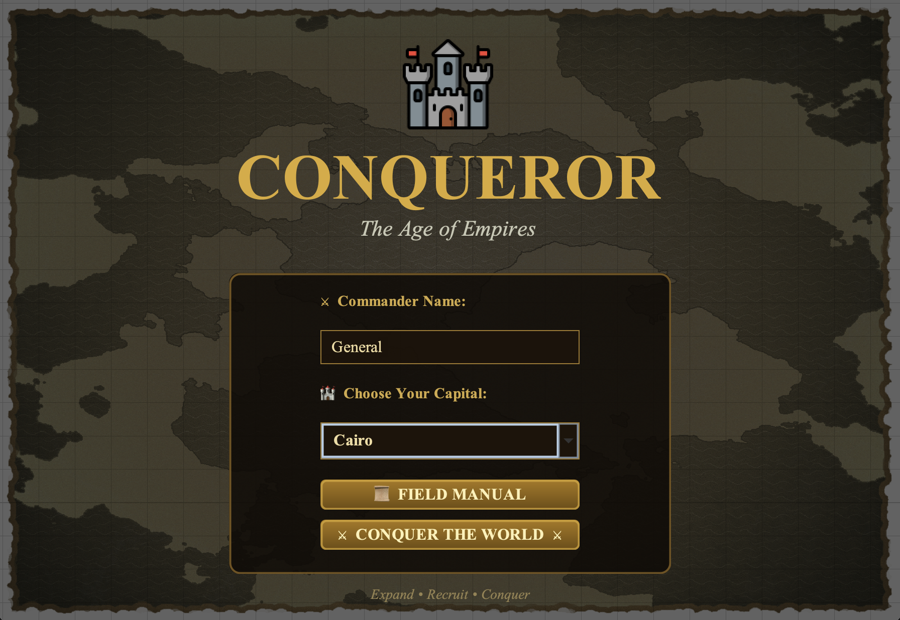

# ⚔️ Imperium Conqueror
### *The Age of Empires*

[](https://adoptium.net/)
[](https://docs.oracle.com/javase/tutorial/uiswing/)
[](/)
[](LICENSE)

*A tactical empire-building strategy game set in 60 BC — conquer Cairo, Rome, and Sparta before time runs out.*

[▶ How to Run](#-how-to-run) · [🎮 Features](#-features) · [📖 Game Guide](#-game-guide) · [🏗 Architecture](#-architecture)

</div>

---

## 🎮 Features

| Feature | Description |
|---|---|
| 🏰 **Empire Management** | Build Farms, Markets, Barracks, Stables, and Archery Ranges across your cities |
| ⚔️ **Army System** | Recruit Archers, Infantry, and Cavalry at 3 upgrade levels each |
| 🗺️ **Strategic Map** | Interactive world map showing city ownership, roads, distances, and army positions |
| 💡 **AI Advisor** | 12-priority hint engine that analyses your game state and recommends the best move |
| 🤖 **Auto-Win AI** | Hand control to the AI and watch it conquer the world autonomously |
| ⚙️ **Siege Warfare** | Lay siege for 3 turns to starve defenders, or auto-resolve battles instantly |
| 🎵 **Medieval Audio** | Real WAV background music + 8 situational sound effects |
| 🖋️ **Custom Fonts** | TeX Gyre Chorus, Bonum, and Lora embedded — no install needed |
| 📖 **Field Manual** | 8-tab in-game guide covering every mechanic |
| ⏸️ **Pause Menu** | ESC anytime for Continue / Field Manual / Restart / Exit |

---

## 📸 Screenshots

### Main Menu & Setup

<table>
  <tr>
    <td width="50%">
      
      <p align="center"><b>Figure 1</b> — Main Menu with medieval map background</p>
    </td>
    <td width="50%">
      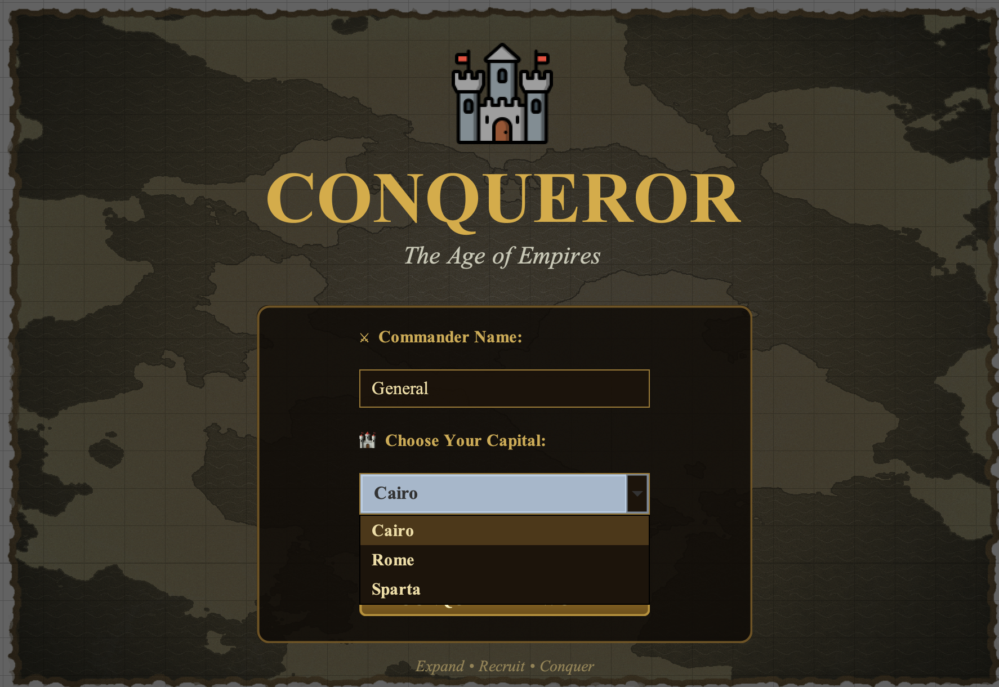
      <p align="center"><b>Figure 2</b> — Choose your starting capital (Cairo / Rome / Sparta)</p>
    </td>
  </tr>
</table>

### Field Manual (How to Play)

<table>
  <tr>
    <td width="50%">
      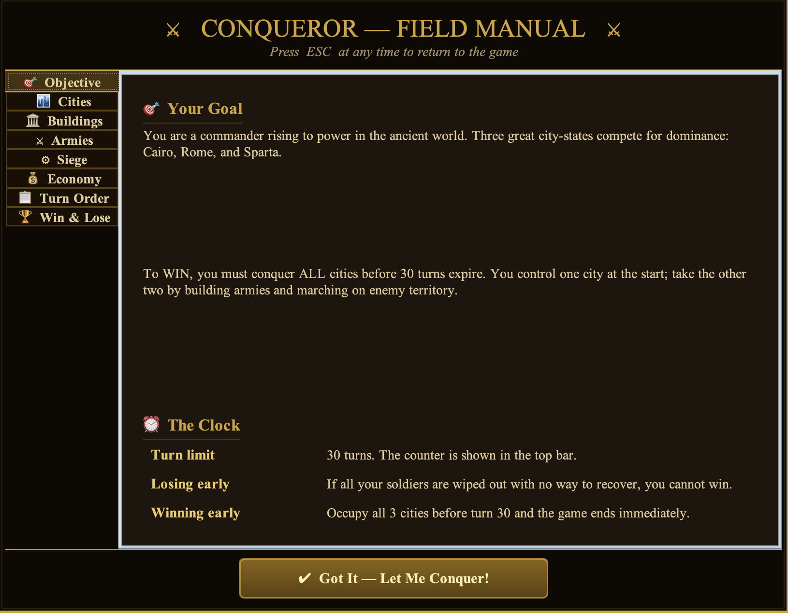
      <p align="center"><b>Figure 3</b> — Field Manual: Objective & Turn Limit tab</p>
    </td>
    <td width="50%">
      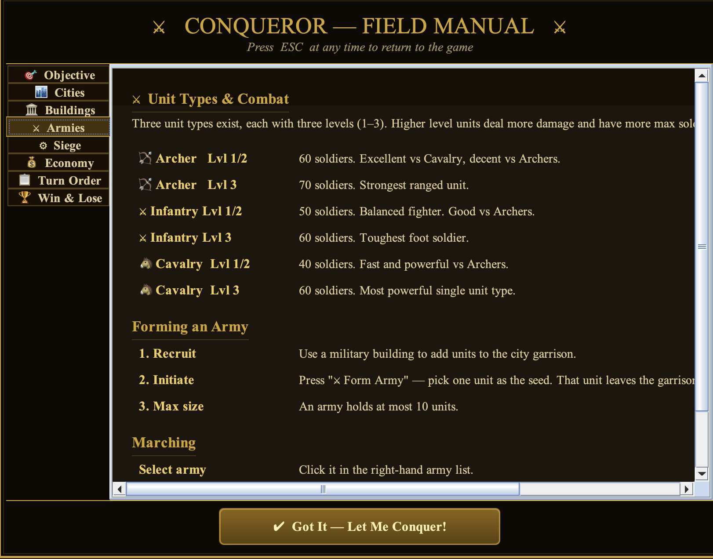
      <p align="center"><b>Figure 4</b> — Field Manual: Unit Types & Combat tab</p>
    </td>
  </tr>
</table>

### Gameplay

<table>
  <tr>
    <td width="50%">
      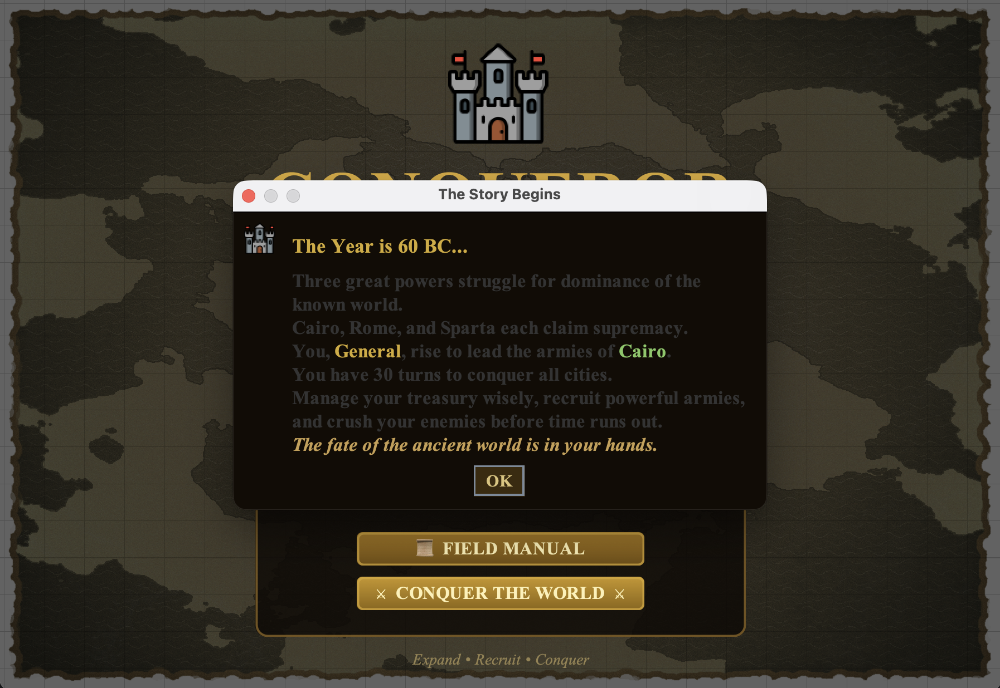
      <p align="center"><b>Figure 5</b> — Story introduction dialog on game start</p>
    </td>
    <td width="50%">
      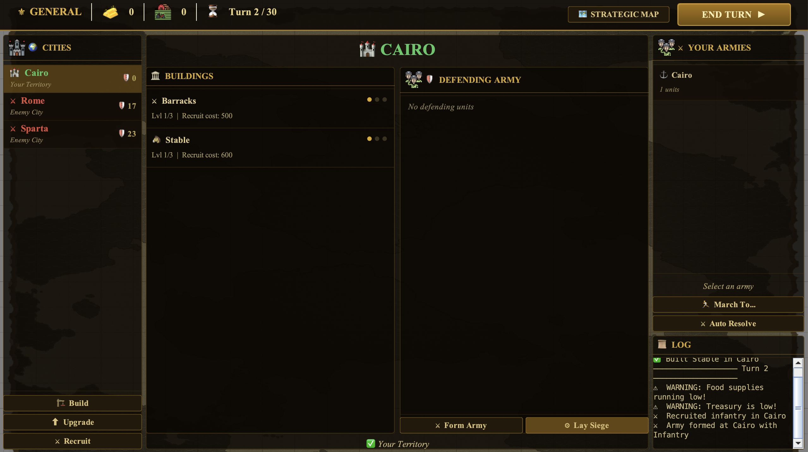
      <p align="center"><b>Figure 6</b> — Main game screen: city list, buildings, garrison, armies</p>
    </td>
  </tr>
  <tr>
    <td width="50%">
      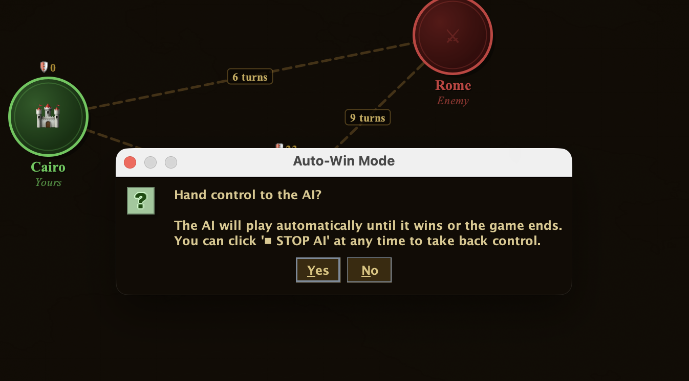
      <p align="center"><b>Figure 7</b> — 🤖 Auto-Win AI mode: AI builds, recruits, and conquers automatically</p>
    </td>
    <td width="50%">
      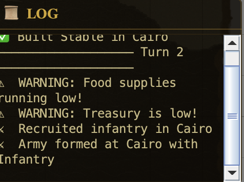
      <p align="center"><b>Figure 8</b> — Real-time action log with warnings and AI decisions</p>
    </td>
  </tr>
</table>

### Strategic Map & Events

<table>
  <tr>
    <td width="50%">
      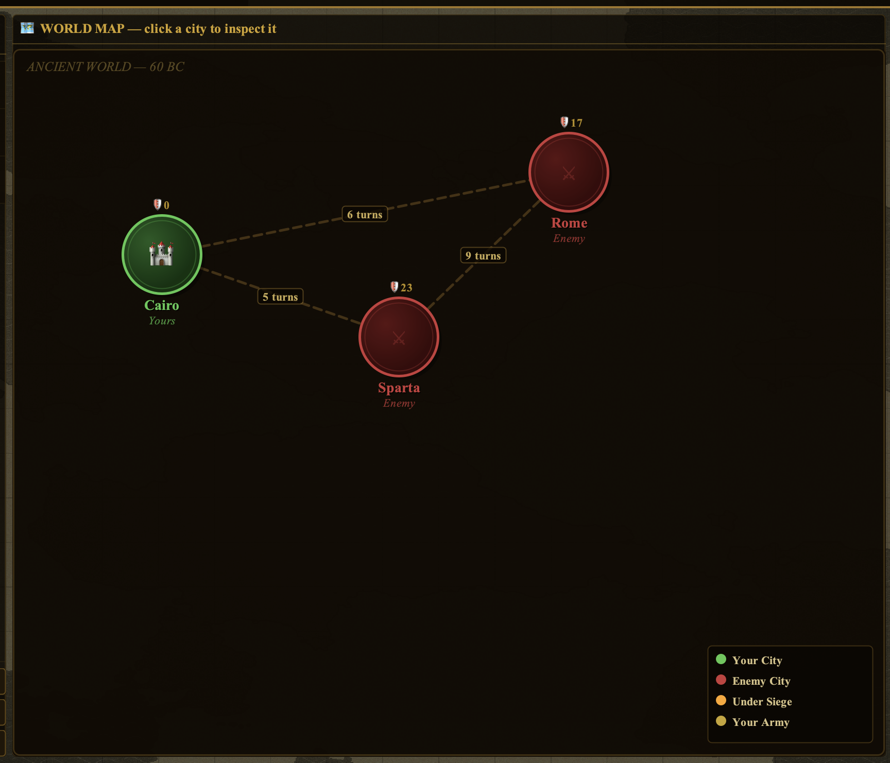
      <p align="center"><b>Figure 9</b> — 🗺️ Strategic Map: city ownership (green = yours, red = enemy), clickable</p>
    </td>
    <td width="50%">
      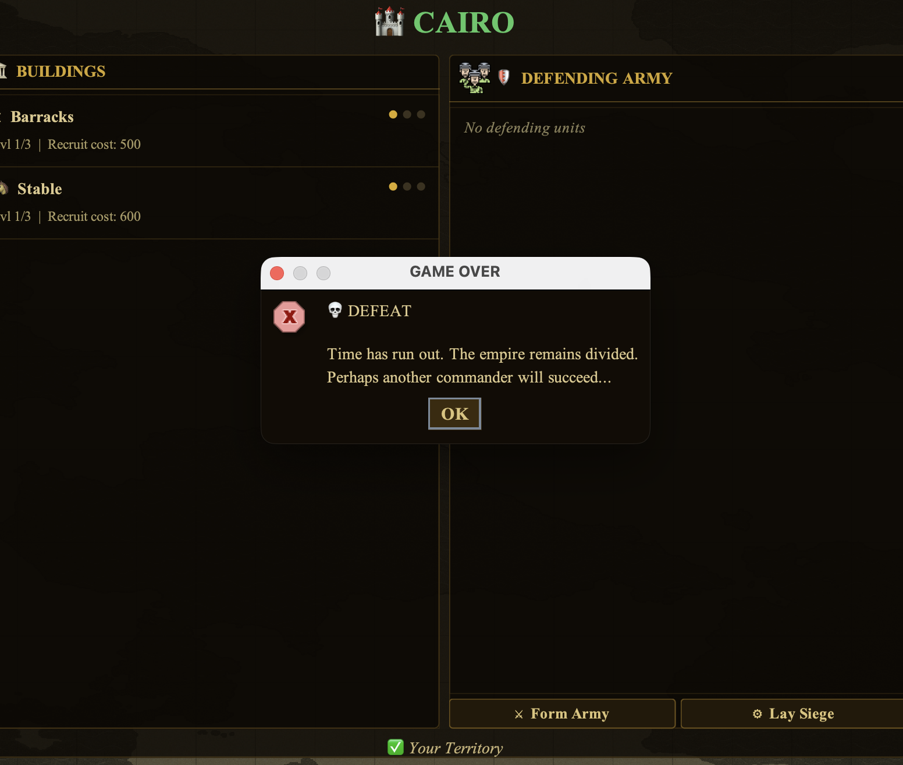
      <p align="center"><b>Figure 10</b> — Defeat screen when the 30-turn limit expires</p>
    </td>
  </tr>
  <tr>
    <td width="50%">
      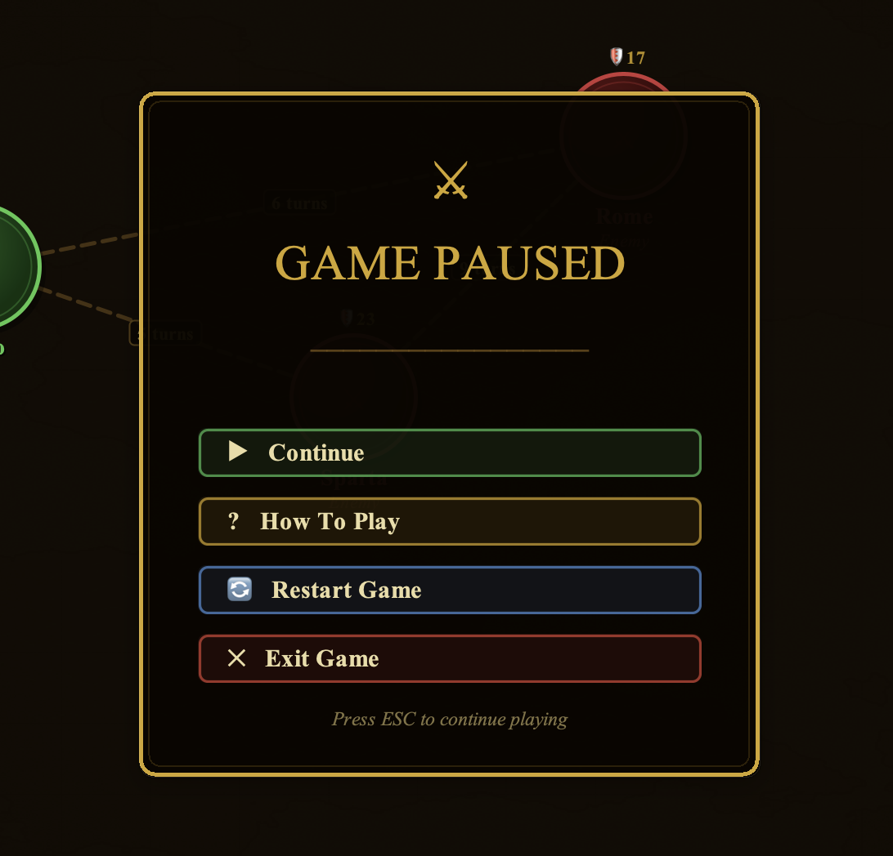
      <p align="center"><b>Figure 11</b> — ⏸️ Pause Menu (ESC): Continue, Field Manual, Restart, Main Menu</p>
    </td>
    <td width="50%">
      <br/><br/>
      <blockquote>
        <p><b>Tip:</b> Press <code>ESC</code> at any time to pause.<br/>
        Press <code>💡 ADVISOR</code> in the top bar for a strategic hint.<br/>
        Press <code>🤖 AUTO-WIN</code> to let the AI play for you.</p>
      </blockquote>
    </td>
  </tr>
</table>

---

## ▶ How to Run

### Option 1 — Runnable JAR (recommended)

```bash
java -jar ConquerorGame.jar
```

> Requires Java 11+. Download from [adoptium.net](https://adoptium.net) if needed.
> The JAR is fully self-contained — all fonts, audio, and CSV data are embedded.

### Option 2 — Compile from source

```bash
# Compile
javac -d out src/exceptions/*.java src/units/*.java src/buildings/*.java \
      src/engine/*.java src/views/*.java src/Main.java

# Run
java -cp out Main
```

### Option 3 — IntelliJ IDEA

1. Open the project folder in IntelliJ
2. Set **Run > Edit Configurations > Working Directory** to the project root
3. Run `Main.java`

---

## 📖 Game Guide

### Objective
Conquer **all 3 cities** (Cairo, Rome, Sparta) within **30 turns**.

### City Distances
| Route | Turns |
|---|---|
| Cairo → Sparta | 5 |
| Cairo → Rome | 6 |
| Sparta → Rome | 9 |

### Buildings

| Building | Cost | Effect |
|---|---|---|
| 🌾 Farm | 1,000 💰 | +500 🌾 food/turn (up to +1,000 at Lv3) |
| 💰 Market | 1,500 💰 | +1,000 💰 gold/turn (up to +2,000 at Lv3) |
| ⚔️ Barracks | 2,000 💰 | Recruit Infantry (500 💰/unit) |
| 🐴 Stable | 2,500 💰 | Recruit Cavalry (600 💰/unit) |
| 🏹 Archery Range | 1,500 💰 | Recruit Archers (400 💰/unit) |

> All buildings start in **cool-down** — wait 1 turn before using them.

### Units

| Type | Soldiers | Strong vs | Weak vs |
|---|---|---|---|
| 🏹 Archer Lv1/2 | 60 | Cavalry | Cavalry |
| 🏹 Archer Lv3 | 70 | Cavalry | — |
| ⚔️ Infantry Lv1/2 | 50 | Archers | Cavalry |
| ⚔️ Infantry Lv3 | 60 | Archers | — |
| 🐴 Cavalry Lv1/2 | 40 | Archers | Infantry |
| 🐴 Cavalry Lv3 | 60 | Archers | — |

### Winning Strategy
1. **Turn 1** — Build Farm + Barracks
2. **Turn 2** — Recruit 3 Infantry, build Market
3. **Turn 3** — Form army, march to Sparta (5 turns away from Cairo)
4. **Turn 8** — Army arrives; Lay Siege or Auto-Resolve
5. **Turn 10+** — Snowball income from 2 cities, march on Rome

---

## 🏗 Architecture

```
src/
├── Main.java                    Entry point — starts audio + launches MainMenuFrame
├── exceptions/                  Full exception hierarchy (EmpireException → 9 concrete types)
│   ├── EmpireException.java
│   ├── BuildingException.java / ArmyException.java
│   └── (7 concrete: MaxLevel, NotEnoughGold, FriendlyCity, TargetNotReached…)
├── units/
│   ├── Unit.java                Abstract: level, soldiers, upkeep rates, attack()
│   ├── Archer.java              Type-based attack factors
│   ├── Infantry.java
│   ├── Cavalry.java
│   ├── Army.java                foodNeeded(), relocateUnit(), handleAttackedUnit()
│   └── Status.java              IDLE / MARCHING / BESIEGING
├── buildings/
│   ├── Building.java            cost, level, coolDown, upgrade()
│   ├── EconomicBuilding.java    → Farm, Market (harvest())
│   └── MilitaryBuilding.java   → Barracks, Stable, ArcheryRange (recruit())
├── engine/
│   ├── Distance.java            City-pair with turn distance
│   ├── City.java                Buildings, defending army, siege state
│   ├── Player.java              build(), recruitUnit(), initiateArmy(), laySiege()
│   └── Game.java                loadCitiesAndDistances(), targetCity(), endTurn(), autoResolve()
└── views/
    ├── FontManager.java         Loads TeX Gyre + Lora from classpath
    ├── AudioManager.java        WAV player with MIDI fallback
    ├── HintEngine.java          12-priority strategic advisor
    ├── AIPlayer.java            SwingWorker auto-win AI
    ├── CityMapPanel.java        Interactive world map (clickable cities, army flags)
    ├── PauseMenuDialog.java     ESC pause: Continue / Field Manual / Restart / Exit
    ├── HowToPlayDialog.java     8-tab Field Manual
    ├── MainMenuFrame.java       Start screen
    └── GameFrame.java           Main game window (1 340 × 840)
```

### Key Design Decisions

- **CSV loading** — `Game.openResource()` tries classpath → JAR sibling → working dir, so the JAR runs from anywhere
- **Audio** — `AudioManager` converts all WAV formats (24-bit, non-44100 Hz) to standard PCM before playback; falls back to synthesized MIDI if files are missing
- **Multi-army selection** — `JList.MULTIPLE_INTERVAL_SELECTION`; March, Siege, and Auto-Resolve all batch-process selected armies
- **AI** — `AIPlayer extends SwingWorker`; `publish()` pipes log messages to EDT so the UI stays live

---

## ✅ Test Results

```
M2 Public Tests  (100 tests) ........ OK
M2 Private Tests  (27 tests) ........ OK
Total: 127 / 127 PASSING ✅
```

Run tests yourself:
```bash
javac -cp junit4.jar:out -d test_out "M1-M2 tests/EmpireM2/src/tests/M2PublicTests.java"
java  -cp junit4.jar:hamcrest.jar:out:test_out org.junit.runner.JUnitCore tests.M2PublicTests
```

---

## 🗂 Project Structure

```
Imperium-Conqueror/
├── src/                   Java source files
├── audio/                 9 WAV sound effects + background music
├── fonts/                 4 OTF/TTF medieval fonts
├── icons/                 PNG icon set
├── background/            Fantasy world map image
├── csv_files/             distances.csv, cairo/rome/sparta_army.csv
├── screenshots/           11 gameplay screenshots
├── ConquerorGame.jar      Self-contained runnable JAR (37 MB)
└── README.md
```

---

## 👤 Author

**Muhammad Magdy** — [@MuhammadMagdyy](https://github.com/MuhammadMagdyy)

Built as part of a Java OOP course project, extended with a full GUI, audio engine, strategic AI, and visual map.

---

<div align="center">

*"The fate of the ancient world is in your hands."*

⭐ Star this repo if you enjoyed it!

</div>
